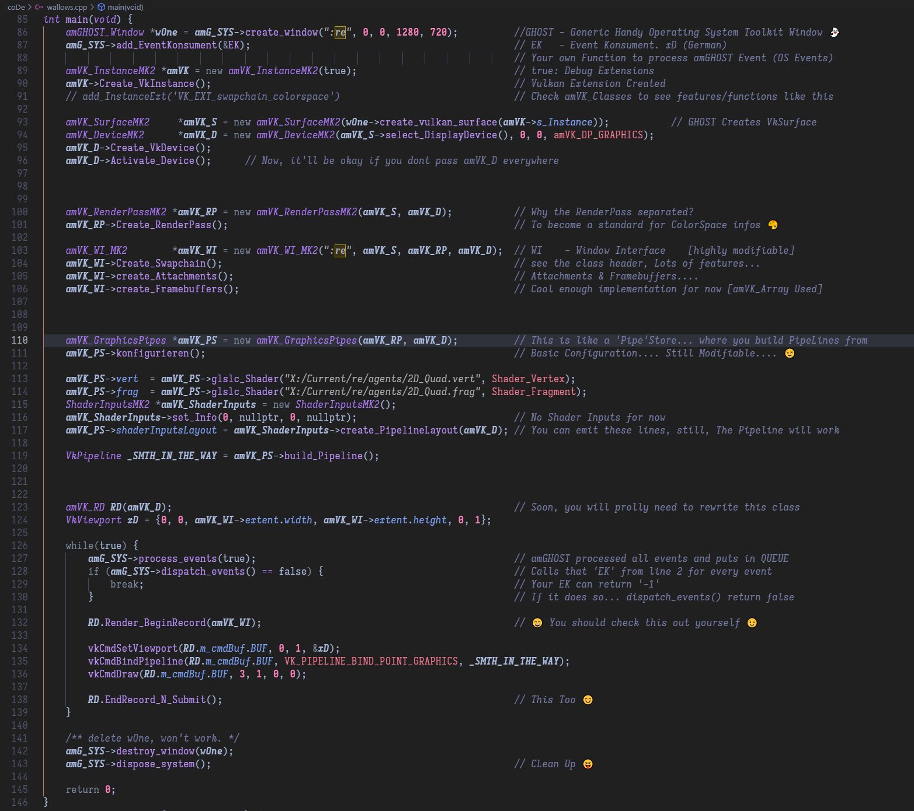

# :𝐫𝐞

### The code in a nutshell.... (initial commit 😜)

### You would need to run `amVK/make.py` & `amGHOST/make.py` to download external-libs
### also `git submodule init` & `git submodule update`

- Dress (Galib Vai....)
- Script (Cold)
- Shots (Cold. Teal & Orange, like the Peripherial)
- Jakka 1000    (+ tuesDay)
- Apex Legends
- Colors & Maybe draw some stickman
- Hisheb-Nikesh
- Fucking Argentina.... xD
- 3900x Voltage Control
- 2D_Image.hh
- check amVK_INK
- Pipeline DOCS (Check 2D_Quad & 2D_Image)
- Added https://anki3d.org/debugprintf-vulkan/ 
    - Official DOcs: https://github.com/KhronosGroup/Vulkan-ValidationLayers/blob/master/docs/debug_printf.md

- Some functions in amVK has 'amVK_D' as member variable... those are like the BIG HEAVY Classes... e.g. amVK_Pipeline, amVK_RenderPassMK2, amVK_WI_MK2
    - Some doesn't.... e.g. amVK_DSetLayout...
      these are like lightweight only helper stuff... that you wanna use like a functions-only-library kinda thingy
      You'll need to pass amVK_D to these classes member functions tho...

- https://asawicki.info/news_1740_vulkan_memory_types_on_pc_and_how_to_use_them
    - HOST_COHERENT

- SO I think we can just do that vkCmdCopyBufferToImage straight away... without TRANSFER COMMAND BUFFER
- + WE can fix image FIT... in shader 😁

- Problems... and Guides on how to fix thems.... (We just wanna list down the things that can go wrong....)
    - RENDER_AREA is smaller than Window
        - Check SHADER code.... is it wrong or smth weird?  [IF You aren't sure TRY Rendering a QUAD....]
        - Check VertexData.... maybe you decoded them wrong.... or converted them wrong, [e.g. BIG-ENDIAN / LITTLE-ENDIAN]
        - [ME NOT SURE] but Wrong DescriptorSet or VKBuffer???
        - Check Pipeline for DYNAMIC Viewport/Scissor....   [IF You are using those.... turn of Scissor.... check if `vkCmdSetViewport` is set RIGHT]
        - Check Swapchain & FrameBuffer sizes....
        - One time I was getting this Problem was when I did VkCmdSetScissors... but those weren't being updated